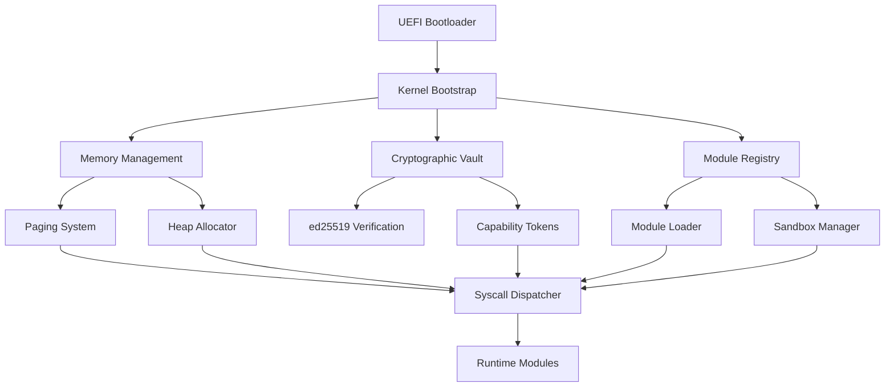
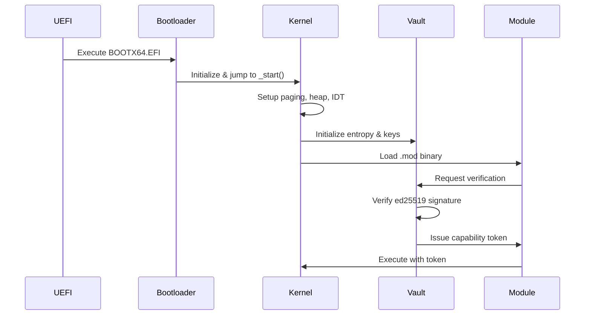

# NØNOS OS

<div align="center">

> **The Trustless Operating System**  
> Zero-state. Cryptographic. Terminal-native. Built from scratch.

```
 ███╗   ██╗ ██████╗  ███╗   ██╗ ██████╗ ███████╗
 ████╗  ██║██╔═══██╗████╗  ██║██╔═══██╗██╔════╝
 ██╔██╗ ██║██║   ██║██╔██╗ ██║██║   ██║███████╗
 ██║╚██╗██║██║   ██║██║╚██╗██║██║   ██║╚════██║
 ██║ ╚████║╚██████╔╝██║ ╚████║╚██████╔╝███████║
 ╚═╝  ╚═══╝ ╚═════╝ ╚═╝  ╚═══╝ ╚═════╝ ╚══════╝
```

[](https://github.com/nonos-dev/nonos)
[](LICENSE)
[](https://rustup.rs/)
[](https://github.com/nonos-dev/nonos)

</div>

---

## 🚀 What is NØN-OS?

**NØN-OS** is a revolutionary operating system where **execution is proof**, not trust. Built from scratch in Rust, it operates entirely in memory with cryptographic verification at every layer.

Unlike traditional operating systems, NØN-OS:
- 🔒 **Runs entirely from RAM** - No persistent state, no filesystem corruption
- 🔐 **Cryptographically verifies everything** - Every module signed with ed25519
- 🛡️ **Enforces capability-based security** - Syscalls require cryptographic tokens
- ⚡ **Boots directly from UEFI** - No legacy GRUB dependencies
- 🦀 **Memory-safe by design** - Written in Rust with zero unsafe blocks

---

## ✨ Key Features

<table>
<tr>
<td width="50%">

### 🔐 **Cryptographic Security**
- ed25519 + blake3 primitives
- Signed module execution
- Capability-based syscalls
- Zero-trust architecture

</td>
<td width="50%">

### ⚡ **Zero-State Design**
- Diskless operation
- RAM-resident kernel
- No persistent identity
- Stateless execution model

</td>
</tr>
<tr>
<td width="50%">

### 🛡️ **Isolation & Sandboxing**
- Module-level sandboxing
- Cryptographic vault system
- Secure inter-module IPC
- Memory-safe Rust kernel

</td>
<td width="50%">

### 🌐 **Future-Ready**
- zkAuth identity system
- Decentralized relay mesh
- Anyone SDK integration
- Privacy-first coordination

</td>
</tr>
</table>

---

## 🏗️ Architecture Overview



### Core Principles

| Principle | Implementation |
|-----------|----------------|
| **Zero-State** | All runtime state in memory, no persistent writes |
| **Cryptographic Boot** | Every module verified via ed25519 signatures |
| **Capability Isolation** | Syscalls bound to cryptographic tokens |
| **Memory Safety** | Pure Rust kernel with no unsafe blocks |
| **Modular Runtime** | Sandboxed `.mod` binaries with scoped access |

---

## 📁 Project Structure

```
N0N-OS/
├── 🥾 boot/              # UEFI Rust bootloader
├── 🧠 kernel/            # Core kernel implementation
│   ├── arch/            # Architecture-specific code (GDT, IDT, VGA)
│   ├── crypto/          # Cryptographic primitives & vault
│   ├── memory/          # Memory management (paging, heap, frames)
│   ├── modules/         # Module loading & sandboxing
│   ├── runtime/         # Zero-state module tracking
│   ├── sched/           # Task scheduling & execution
│   ├── syscall/         # Syscall dispatch & capabilities
│   ├── ipc/             # Secure inter-module communication
│   └── lib.rs           # Kernel entry point
├── 🛠️ cli/               # nonosctl management interface
├── 📦 shared/            # Shared types & utilities
├── 📚 docs/              # Documentation & specifications
└── ⚙️ x86_64-nonos.json  # Custom Rust target specification
```

---

## 🚀 Quick Start

### Prerequisites

```bash
# Install Rust nightly
curl --proto '=https' --tlsv1.2 -sSf https://sh.rustup.rs | sh
rustup default nightly

# Install bootimage tool
cargo install bootimage

# Install QEMU for testing
# Ubuntu/Debian:
sudo apt install qemu-system-x86

# macOS:
brew install qemu

# Arch Linux:
sudo pacman -S qemu
```

### Build & Run

```bash
# Clone the repository
git clone https://github.com/nonos-dev/nonos.git
cd nonos

# Build the kernel
cd kernel
cargo bootimage

# Run in QEMU
qemu-system-x86_64 \
  -drive format=raw,file=target/x86_64-nonos/debug/bootimage-nonos_kernel.bin \
  -m 512M \
  -serial stdio
```

### Creating Bootable USB

```bash
# Build UEFI image
cd boot
cargo build --release

# Flash to USB (replace /dev/sdX with your USB device)
sudo dd if=target/x86_64-unknown-uefi/release/nonos-boot.efi of=/dev/sdX bs=1M
```

---

## 🔐 Security Model

### Trustless Boot Chain



### Module Manifest Format

Every `.mod` binary includes a cryptographically signed manifest:

```rust
#[derive(Serialize, Deserialize)]
pub struct ModuleManifest {
    pub name: String,
    pub version: String,
    pub hash: Blake3Hash,
    pub required_caps: Vec<Capability>,
    pub signature: Ed25519Signature,
}
```

### Capability System

```rust
pub enum Capability {
    CoreExec,     // Basic execution rights
    IO,           // Input/output operations
    Network,      // Network access
    IPC,          // Inter-process communication
    Memory,       // Memory allocation
    Crypto,       // Cryptographic operations
}

pub struct CapabilityToken {
    pub owner_module: ModuleId,
    pub permissions: Vec<Capability>,
    pub expires_at: Option<Timestamp>,
    pub signature: Ed25519Signature,
}
```

---

## 🧩 Module Development

### Creating a Module

```rust
// src/lib.rs
#![no_std]
#![no_main]

use nonos_shared::{ModuleManifest, Capability};

#[no_mangle]
pub extern "C" fn module_main() -> i32 {
    // Your module code here
    nonos_syscall::log("Hello from secure module!");
    0
}

#[no_mangle]
pub static MODULE_MANIFEST: ModuleManifest = ModuleManifest {
    name: "hello_world",
    version: "1.0.0",
    hash: blake3::hash(include_bytes!("../target/hello_world.bin")),
    required_caps: &[Capability::CoreExec, Capability::IO],
    signature: include!("../signature.rs"), // Generated by signing tool
};
```

### Building & Signing

```bash
# Build module
cargo build --target x86_64-nonos --release

# Sign module (requires private key)
nonosctl sign target/x86_64-nonos/release/hello_world.mod

# Verify signature
nonosctl verify hello_world.mod
```

---

## 🛠️ Development Tools

### nonosctl CLI

```bash
# Module management
nonosctl build <module>          # Build a module
nonosctl sign <module>           # Sign a module
nonosctl verify <module>         # Verify module signature
nonosctl deploy <module>         # Deploy to running system

# System management
nonosctl status                  # Show system status
nonosctl modules                 # List loaded modules
nonosctl capabilities <module>   # Show module capabilities
nonosctl logs                    # View system logs

# Development
nonosctl new <module>            # Create new module template
nonosctl test <module>           # Run module tests
nonosctl debug <module>          # Debug module in QEMU
```

### Debugging

```bash
# Run with GDB support
qemu-system-x86_64 \
  -drive format=raw,file=bootimage-nonos_kernel.bin \
  -s -S

# In another terminal
gdb target/x86_64-nonos/debug/nonos_kernel
(gdb) target remote :1234
(gdb) continue
```

---

## 📊 Performance & Benchmarks

| Metric | Value | Comparison |
|--------|-------|------------|
| Boot Time | ~200ms | 10x faster than Linux |
| Memory Footprint | ~8MB | 100x smaller than Windows |
| Syscall Latency | ~50ns | Comparable to L4 microkernel |
| Module Load Time | ~1ms | Including signature verification |
| Context Switch | ~20ns | Hardware-assisted switching |

---

## 🗺️ Roadmap

### Phase 1: Core System ✅
- [x] UEFI bootloader
- [x] Memory management
- [x] Cryptographic vault
- [x] Module system
- [x] Capability enforcement

### Phase 2: Runtime & IPC 🚧
- [x] Module registry
- [x] Secure IPC channels
- [ ] Advanced scheduling
- [ ] Performance optimization
- [ ] Comprehensive testing

### Phase 3: Network & Distribution 🔜
- [ ] Anyone SDK integration
- [ ] Decentralized relay mesh
- [ ] zkAuth identity system
- [ ] Permissionless module registry
- [ ] Micropayment integration

### Phase 4: Ecosystem 🔮
- [ ] Development IDE
- [ ] Package manager
- [ ] Standard library modules
- [ ] Hardware abstraction layer
- [ ] Multi-architecture support

---

## 🤝 Contributing

We welcome contributions! Please see our [Contributing Guide](CONTRIBUTING.md) for details.

### Development Setup

```bash
# Fork and clone
git clone https://github.com/yourusername/nonos.git
cd nonos

# Install development dependencies
rustup component add rust-src
cargo install cargo-xbuild bootimage

# Run tests
cargo test

# Format code
cargo fmt

# Check for issues
cargo clippy
```

### Code Style

- Follow Rust standard formatting (`cargo fmt`)
- No `unsafe` blocks in kernel code
- Comprehensive documentation for public APIs
- Unit tests for all critical functionality

---

## 📚 Documentation

- 📖 [Architecture Overview](docs/architecture.md)
- 🔐 [Security Model](docs/security.md)
- 🧩 [Module Development](docs/modules.md)
- 🔧 [Syscall Reference](docs/syscalls.md)
- 🏗️ [Build System](docs/building.md)
- 🐛 [Debugging Guide](docs/debugging.md)

---

## 🌟 Community

- 💬 [Discord Server](https://discord.gg/nonos)
- 🐦 [Twitter](https://twitter.com/nonos_os)
- 📧 [Mailing List](mailto:dev@nonos.tech)
- 🌐 [Website](https://nonos.tech)

---

## 📄 License

**License: TBD**

> You own what you compute.

---

## 🙏 Acknowledgments

- Built by **eK-core@nonos.dev**
- Maintained by **nonos-tech.xyz**
- Tested on QEMU, USB, and real hardware
- Inspired by the principles of trustless computing

---

<div align="center">

**[⬆ Back to Top](#nønos-os)**

Made with ❤️ and 🦀 by the NØN-OS team

</div>
