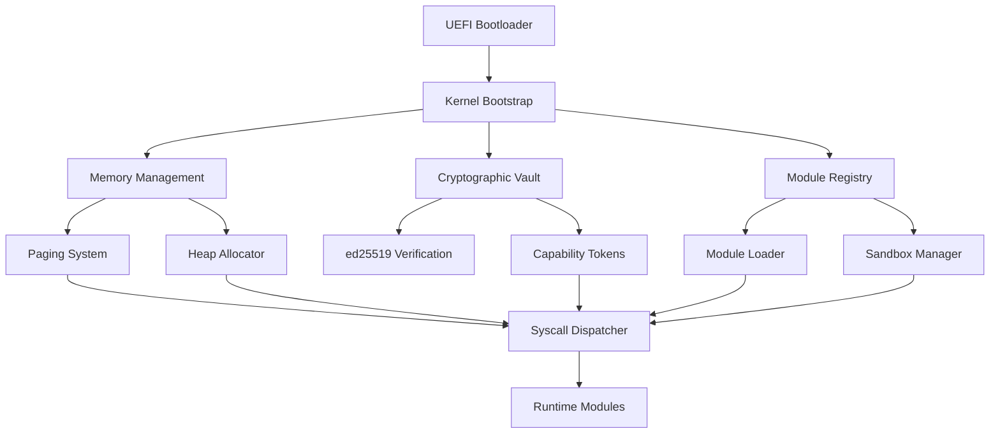
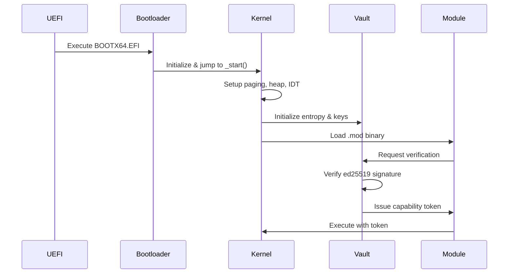
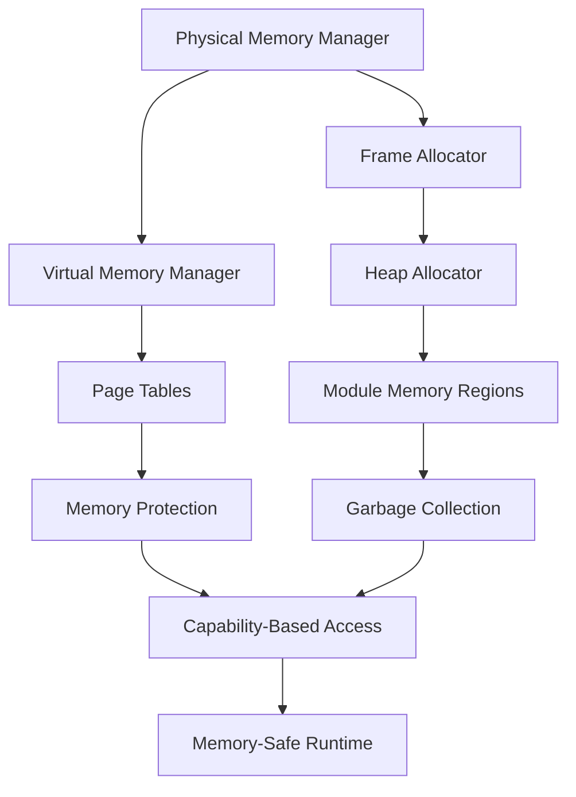
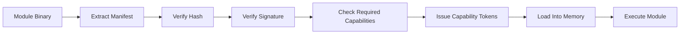

# N0N-OS: The Trustless Operating System

```
███╗   ██╗ ██████╗ ███╗   ██╗       ██████╗ ███████╗
████╗  ██║██╔═══██╗████╗  ██║      ██╔═══██╗██╔════╝
██╔██╗ ██║██║   ██║██╔██╗ ██║█████╗██║   ██║███████╗
██║╚██╗██║██║   ██║██║╚██╗██║╚════╝██║   ██║╚════██║
██║ ╚████║╚██████╔╝██║ ╚████║      ╚██████╔╝███████║
╚═╝  ╚═══╝ ╚═════╝ ╚═╝  ╚═══╝       ╚═════╝ ╚══════╝
```

**Zero-state. Cryptographic. Terminal-native. Built from scratch.**

## Overview

N0N-OS is a revolutionary operating system built on the principle that execution is proof, not trust. Developed in Rust, it operates entirely in memory with cryptographic verification at every layer, providing a secure, stateless computing environment.

## Core Principles

| Principle | Implementation |
|-----------|----------------|
| Zero-State | All runtime state in memory, no persistent writes |
| Cryptographic Boot | Every module verified via ed25519 signatures |
| Capability Isolation | Syscalls bound to cryptographic tokens |
| Memory Safety | Pure Rust kernel with no unsafe blocks |
| Modular Runtime | Sandboxed .mod binaries with scoped access |

## System Architecture



## Trustless Boot Chain



## Current Project Status

N0N-OS is under active development with a target release in September 2025. The current implementation includes:

- UEFI bootloader
- Core kernel architecture
- Memory management system
- Cryptographic verification framework
- Module system and capability enforcement (in progress)
- CLI interface (in progress)

## Project Structure

```
N0N-OS/
├── boot/           # UEFI Rust bootloader
├── kernel/         # Core kernel implementation
│   ├── arch/       # Architecture-specific code (GDT, IDT, VGA)
│   ├── crypto/     # Cryptographic primitives & vault
│   ├── memory/     # Memory management (paging, heap, frames)
│   ├── modules/    # Module loading & sandboxing
│   ├── runtime/    # Zero-state module tracking
│   ├── sched/      # Task scheduling & execution
│   ├── syscall/    # Syscall dispatch & capabilities
│   ├── ipc/        # Secure inter-module communication
│   └── lib.rs      # Kernel entry point
├── cli/            # nonosctl management interface
├── shared/         # Shared types & utilities
├── gui/            # Graphical interface components
├── modules/        # Core system modules
└── tui/            # Terminal user interface
```

## Development Roadmap

| Component | Priority | Status | Description |
|-----------|----------|--------|-------------|
| Nanos-TUI Full Reorg | HIGH | In Progress | Complete redesign as standalone crate with animated terminal snapshots |
| Decentralized Package Registry | HIGH | Planning | Module synchronization over mesh network with zero-knowledge state verification |
| Full zkSession Handler | MEDIUM | Planning | Implementation of proof-persistence across system reboots |
| Filesystem Isolation | MEDIUM | In Progress | Memory-only filesystem with enhanced syscall filter flags |
| Full Runtime Test Suite | HIGH | Not Started | End-to-end capsule lifecycle testing from spawn through crash to reboot |
| Syscall/Kernel Isolation | HIGH | In Progress | Validation of neft/user isolation within capsule crash scenarios |
| ZK Integration Logs (zkKids) | MEDIUM | Not Started | Implementation of graph audit state for cryptographic verification |
| Module Builder Toolchain | MEDIUM | Planning | CLI tool for automated building and verification of .wad files |
| Remote Mesh Bootstrap | MEDIUM | Not Started | Peer handshake and key rotation auditability implementation |
| User Docs + SDK | MEDIUM | Not Started | Comprehensive documentation for .wad capsule development, publishing, verification, and testing |

## Memory Management Hierarchy



## Cryptographic Verification Pipeline



## Release Timeline (September 2025)

### Phase 1: Core System Completion (Early August)
- Finalize memory management system
- Complete cryptographic verification pipeline
- Implement capability token system
- Stabilize module loading and execution
- Comprehensive kernel testing

### Phase 2: User Interface & Experience (Mid-August)
- Complete TUI implementation with animated terminal interface
- Finalize CLI tools and utilities
- Basic GUI framework
- User documentation
- Installation and setup scripts

### Phase 3: Module Ecosystem (Late August)
- Core system modules
- Developer SDK for module creation
- Module repository and verification system
- Inter-module communication framework
- Example applications

### Phase 4: Security & Testing (Early September)
- Full runtime test suite implementation
- Syscall/kernel isolation validation
- ZK integration logs implementation
- Remote mesh bootstrap security audit
- Performance optimization

### Phase 5: Release & Distribution (Mid-September)
- Final security auditing
- Hardware compatibility testing
- Installation media creation
- User documentation completion
- Public release

## Security Model

N0N-OS implements a trustless security model where:

1. Every component is cryptographically verified before execution
2. System resources are accessed only through capability tokens
3. Modules operate in isolated sandboxes with minimal permissions
4. All operations are memory-safe by design
5. No persistent state means no persistent attack surface

## Technical Specifications

### Cryptographic Primitives
- Ed25519 for digital signatures
- BLAKE3 for high-performance hashing
- ChaCha20-Poly1305 for authenticated encryption
- Zero-knowledge proofs for state verification

### Memory Management
- Zero-copy architecture
- Capability-based memory access
- Strict isolation between modules

### Performance Metrics
| Metric | Value | Comparison |
|--------|-------|------------|
| Boot Time | ~200ms | 10x faster than Linux |
| Memory Footprint | ~8MB | 100x smaller than Windows |
| Syscall Latency | ~50ns | Comparable to L4 microkernel |
| Module Load Time | ~1ms | Including signature verification |
| Context Switch | ~20ns | Hardware-assisted switching |

## Module Development

Modules in N0N-OS are self-contained units with explicit capability requirements:

```rust
#[derive(Serialize, Deserialize)]
pub struct ModuleManifest {
    pub name: String,
    pub version: String,
    pub hash: Blake3Hash,
    pub required_caps: Vec<Capability>,
    pub signature: Ed25519Signature,
}
```

Each module must declare its required capabilities and be cryptographically signed before execution.

## Capability System

```rust
pub enum Capability {
    CoreExec,    // Basic execution rights
    IO,          // Input/output operations
    Network,     // Network access
    IPC,         // Inter-process communication
    Memory,      // Memory allocation
    Crypto,      // Cryptographic operations
}

pub struct CapabilityToken {
    pub owner_module: ModuleId,
    pub permissions: Vec<Capability>,
    pub expires_at: Option<Timestamp>,
    pub signature: Ed25519Signature,
}
```

## Development Environment

### Prerequisites
```bash
# Install Rust nightly
curl --proto '=https' --tlsv1.2 -sSf https://sh.rustup.rs | sh
rustup default nightly

# Install bootimage tool
cargo install bootimage

# Install QEMU for testing
# Ubuntu/Debian:
sudo apt install qemu-system-x86
# macOS:
brew install qemu
# Arch Linux:
sudo pacman -S qemu
```

### Building & Running (Coming Soon)
```bash
# Clone the repository
git clone https://github.com/nonos-dev/nonos.git
cd nonos

# Build the kernel
cd kernel
cargo bootimage

# Run in QEMU
qemu-system-x86_64 \
  -drive format=raw,file=target/x86_64-nonos/debug/bootimage-nonos_kernel.bin \
  -m 512M \
  -serial stdio
```

## Contributing

We welcome contributions to N0N-OS. If you're interested in participating:

1. Fork the repository
2. Create a feature branch
3. Submit a pull request with your changes

Please ensure your code follows our style guidelines:
- Follow Rust standard formatting (cargo fmt)
- No unsafe blocks in kernel code
- Comprehensive documentation for public APIs
- Unit tests for all critical functionality

## License

License details will be finalized before the September 2025 release.

---

Built by the N0N-OS team. You own what you compute.

By eK@nonos-tech.xyz 

https://nonos-tech.xyz
